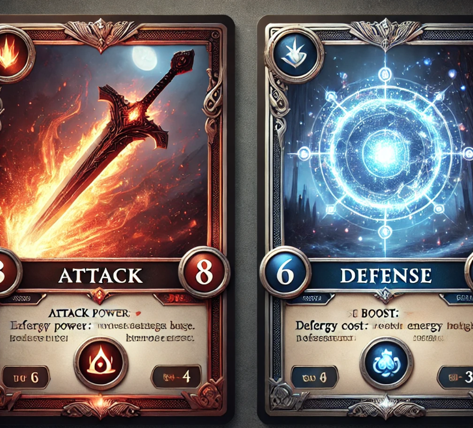

<!--  -->
# Card Game

<center>

</center>

## 1. Introdução

Vamos criar um jogo de RPG de Cartas, inspirado em HearthStone, focando nos princípios da Programação Orientada a Objetos (POO) para ensinar os conceitos fundamentais.

## 2. Regras do Jogo

### 2.1. Dinâmica do Jogo:

Cada jogador começa com:
- 30 pontos de vida
- 10 pontos de energia
- Um baralho de 40 cartas (20 de ataque e 20 de defesa)
- Cada turno segue esta sequência:

O jogador joga uma carta de seu deck, de sua escolha. O computador também joga uma carta automaticamente.
Ambos regeneram 2 pontos de energia (até o máximo de 10). Em cada turno, cada jogador pode jogar 1 carta. Se for uma carta de ataque, ela causa dano. Se for uma carta de defesa, ela cura pontos de vida.

### 2.2. Energia 
- Cada jogador tem uma quantidade de energia, que começa com 10 pontos.
- A energia é necessária para jogar cartas.
- Cada carta tem um custo de energia, que é gasto ao usá-la.
- No início de cada turno, o jogador recupera +2 pontos de energia (até um máximo de 10).
- Não há cartas específicas para recuperar energia (ela se regenera automaticamente no início de cada turno).

### 2.3. Tipos de Cartas:
- Cartas de Ataque 🗡️ → Gastam energia e reduzem a vida do inimigo.
- Cartas de Defesa 🛡️ → Gastam energia e restauram pontos de vida.

O jogo termina quando um dos jogadores fica com 0 de vida.

### 2.4.Exemplo de Partida

```
Início do Jogo:
Jogador (Herói) - Vida: 30 | Energia: 10  
Computador (Vilão) - Vida: 30 | Energia: 10 

Sua mão:  
1: Espada Flamejante (Custo: 3, Dano: 5)  
2: Poção de Vida (Custo: 2, Cura: 4)  
Escolha uma carta para jogar (1 ou 2):

✅ Se escolher Espada Flamejante:
Herói usou Espada Flamejante, causando 5 de dano!  
Vilão - Vida: 25 

✅ Se escolher Poção de Vida:
Herói usou Poção de Vida, recuperando 4 de vida!  
Herói - Vida: 34  

✅ Turno do Computador:
Vilão usou Lança Sombria, causando 6 de dano!
Herói - Vida: 28  

Os jogadores regeneram 2 pontos de energia, e o próximo turno começa.
```

### 2.5. Estratégia do Jogo
- Gerenciar a energia: Se gastar tudo rapidamente, pode ficar sem poder jogar boas cartas.
- Equilibrar ataque e defesa: Só atacar pode ser perigoso se não tiver cura suficiente.
- Aproveitar cartas poderosas no momento certo: Algumas cartas são mais eficientes se jogadas no momento certo.

### 2.6. Cartas

#### 2.6.1. Cartas de Ataque (20 cartas)
Estas cartas gastam energia e causam dano ao inimigo.

| Nome da Carta	 | Custo de Energia	| Dano Causado | Descrição |
| -------------- | ---------------- | ------------ | --------- |
Golpe Rápido | 1 | 2 | Um corte veloz que fere o oponente.
Estocada Precisa | 2 | 4 | Um ataque certeiro que perfura a defesa.
Machado Brutal | 3 | 6 | Um golpe destruidor com machado pesado.
Espada Flamejante | 3 | 5 | Um corte envolto em chamas, causando queimaduras.
Flecha Venenosa | 2 | 3 | Atinge o inimigo e causa dano persistente.
Rajada de Gelo | 3 | 4 | Um golpe congelante que reduz a movimentação.
Golpe Sombrio | 4 | 8 | Um ataque das trevas, consumindo energia vital.
Fúria do Berserker | 5 | 10 | Um ataque feroz, mas consome toda sua energia.
Impacto Sísmico | 6 | 12 | Um golpe que faz o chão tremer, atingindo em cheio.
Lança Sombria | 4 | 6 | Uma lança de energia negra atravessa o adversário.
Flecha Tripla | 3 | 5 | Três flechas rápidas atingem o inimigo ao mesmo tempo.
Espinhos do Caos | 4 | 7 | Projeta espinhos mágicos que perfuram a armadura.
Trovão Arcano | 5 | 9 | Um raio destruidor cai sobre o oponente.
Golpe Veloz | 2 | 4 | Um ataque ágil que confunde o inimigo.
Rajada de Lâminas | 4 | 7 | Várias lâminas cortam o oponente de diferentes ângulos.
Garras da Fera | 3 | 5 | Um ataque selvagem como de uma fera raivosa.
Chamas do Inferno | 6 | 11 | Um fogo intenso consome o adversário.
Corte Duplo | 3 | 5 | Dois cortes rápidos que ignoram parte da defesa.
Golpe Fantasma | 5 | 9 | Uma espada espectral atinge o inimigo sem ser bloqueada.
Lança de Sangue | 4 | 7 | Usa o próprio sangue para fortalecer o ataque.

#### 2.6.2. Cartas de Defesa (20 cartas)
Estas cartas gastam energia e curam pontos de vida.

| Nome da Carta	 | Custo de Energia	| Vida Restaurada | Descrição |
| -------------- | ---------------- | --------------- | --------- |
Poção de Cura | 2 | 4 | Uma poção básica que recupera energia vital.
Escudo Espiritual | 3 | 6 | Uma barreira de luz bloqueia ataques.
Regeneração Mágica | 4 | 7 | Uma magia que regenera feridas lentamente.
Cura do Druida | 3 | 5 | A energia da natureza restaura suas forças.
Armadura de Pedra | 4 | 6 | Endurece sua pele como rocha.
Aura de Vida | 5 | 8 | Um brilho sagrado envolve o corpo, curando ferimentos.
Bênção dos Ancestrais | 6 | 10 | Espíritos antigos restauram sua vitalidade.
Meditação Interior | 2 | 4 | Acalma a mente e acelera a cura natural.
Pele de Aço | 3 | 5 | Fortalece a resistência física por alguns instantes.
Muralha Arcana | 4 | 6 | Uma barreira mágica absorve parte do impacto.
Fôlego Renovado | 2 | 3 | Um segundo fôlego para continuar lutando.
Reflexos Felinos | 3 | 5 | Movimentos rápidos evitam golpes fatais.
Escudo Elemental | 4 | 7 | Uma barreira de fogo, gelo ou trovão protege você.
Proteção Divina | 5 | 9 | Luz celestial fortalece sua alma.
Pele do Dragão | 6 | 11 | Adquire resistência lendária temporária.
Poção de Vitalidade | 2 | 4 | Uma mistura poderosa que restaura o vigor.
Resiliência Suprema | 5 | 9 | Suporta ataques com a força de um titã.
Armadura Sagrada | 6 | 12 | A luz purifica seu corpo, curando feridas profundas.
Restauração Total | 7 | 15 | Uma magia suprema que regenera completamente.
Cura Sombria | 4 | 6 | Poder negro que sacrifica um pouco de energia para curar.

#### 2.2.1. Estratégia da Energia
- Gastar tudo de uma vez pode ser arriscado pois, sem energia, não dá para usar cartas fortes no turno seguinte.
- Cartas baratas são úteis para manter jogadas constantes, enquanto cartas mais caras exigem planejamento.
- A regeneração automática incentiva um ritmo equilibrado entre ataque e defesa.

### Como isso influencia a estratégia?
- Cartas de ataque fortes custam mais energia, então você precisa escolher quando usá-las.
- Cartas de defesa poderosas podem virar o jogo, mas gastam energia que poderia ser usada para atacar.
- Combinar cartas certas no momento certo pode garantir a vitória!

### 2.7. Fim do Jogo
E se acabarem as cartas e ambos ainda tiverem vida maior que zero?
Quando todas as cartas são usadas, o baralho é reembaralhado e os jogadores continuam jogando, com isso tem-se  vantagem de garantir que o jogo continue até um vencedor ser decidido, porém, como desvantagem, pode tornar o jogo muito longo.


## 3. E o Que Torna este Jogo um bom exercício de POO?
- Herança → Cartas compartilham um comportamento básico, mas têm efeitos diferentes.
- Encapsulamento → Atributos protegidos para controle interno.
- Polimorfismo → CartaAtaque e CartaDefesa têm sua própria implementação do método Usar().
- Extra: Interação Jogador vs Computador → Simula uma IA básica para decisões estratégicas.

Este jogo simples, mas estratégico, é ótimo para ensinar POO de forma prática!
